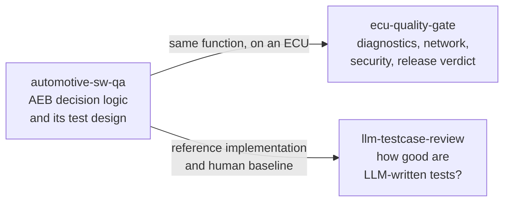

# Eungyun Im

Building autonomous driving software that holds up outside the lab.

I'm a 3rd-year Automotive Engineering student at Kookmin University. I develop perception and control systems for scale cars and full-size EVs through [KUUVe](https://github.com/KUUVe-KMU), the autonomous driving research club I lead. I care about the gap between benchmark numbers and real-world field behavior, and about building the process that closes it.

---

## Focus areas

**Autonomous driving stack** — Integrating perception, localization, and control end-to-end on a real vehicle and validating behavior through repeated field tests.

**Edge AI deployment** — Getting inference models onto constrained hardware and verifying that speed and accuracy hold across devices and conditions.

**Field fault isolation** — Tracing failures from symptom to root cause through logs, layer by layer, until the fix is provable and the regression is documented.

---

## Featured work

Three projects that verify the same automatic emergency braking function at three levels: the unit, the ECU on its network, and the test design process itself.

| Project | Level | What it does |
|---|---|---|
| **[ecu-quality-gate](https://github.com/eungyun-im/ecu-quality-gate)** | ECU and network | Release gate for ECU software. UDS diagnostics over ISO-TP (udsoncan, can-isotp, python-can), CAN timing and security checks run on a virtual bench, and a build with seven planted defects proves the suites catch them. |
| **[automotive-sw-qa](https://github.com/eungyun-im/automotive-sw-qa)** | Software unit | Requirement-based testing of one function in three forms (Simulink/Stateflow model, C code, Python reference) compared back to back, with the test design measured by coverage up to MC/DC and by mutation testing. |
| **[llm-testcase-review](https://github.com/eungyun-im/llm-testcase-review)** | Test design research | Measures LLM-written test cases by executing them on reference and defect versions, and repairs the test set with boundary, cross-check and mutation feedback. |

---

## Stack

---

## Experience

`2026.01 — Present` &nbsp; President — KUUVe · Kookmin University Unmanned Vehicle  
`2025.06 — Present` &nbsp; Field Test Engineer — KUUVe Scale Car Project  
`2023 — Present` &nbsp;&nbsp;&nbsp;&nbsp;&nbsp;&nbsp; B.E. Automotive Engineering — Kookmin University

---

## Awards

`2026.07` &nbsp; SEA:ME Hackathon (Volkswagen Foundation) — **Gold Prize**  
`2026` &nbsp;&nbsp;&nbsp;&nbsp;&nbsp;&nbsp; Autonomous Robot Race, Round 3 — **Excellence Award (3rd)**  
`2026.03` &nbsp; 5th Int'l University EV Autonomous Driving Competition — **Effort Award**

---

