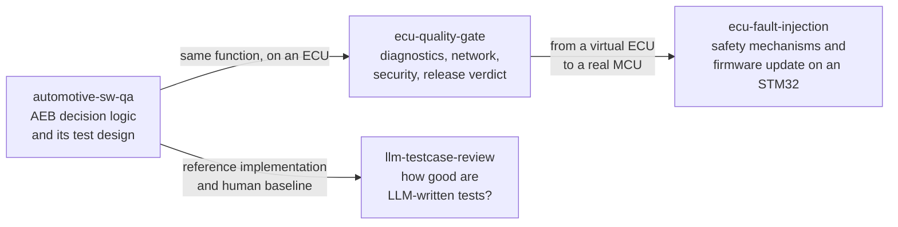

# Eungyun Im

Building autonomous driving software that holds up outside the lab.

I'm a 3rd-year Automotive Engineering student at Kookmin University. I develop perception and control systems for scale cars through [KUUVe](https://github.com/KUUVe-KMU), the autonomous driving research club I lead. I care about the gap between benchmark numbers and real-world field behavior, and about building the process that closes it.

Tracing failures on a real car is what led me to software verification: designing tests from requirements, injecting faults on purpose, and measuring whether the tests themselves are any good.

---

## Focus areas

**Autonomous driving stack** — Integrating perception, localization, and control end-to-end on a real vehicle and validating behavior through repeated field tests.

**Edge AI deployment** — Getting inference models onto constrained hardware and verifying that speed and accuracy hold across devices and conditions.

**Field fault isolation** — Tracing failures from symptom to root cause through logs, layer by layer, until the fix is provable and the regression is documented.

---

## Featured work

Three projects verify the same automatic emergency braking function at three levels: the unit, the ECU on its network, and the test design process itself. A fourth takes the question to real hardware: do the safety mechanisms of an ECU work when the fault actually happens?

| Project | Level | What it does |
|---|---|---|
| **[automotive-sw-qa](https://github.com/eungyun-im/automotive-sw-qa)** | Software unit | Requirement-based testing of one function in three forms (Simulink/Stateflow model, C code, Python reference) compared back to back, with the test design measured by coverage up to MC/DC and by mutation testing. |
| **[ecu-quality-gate](https://github.com/eungyun-im/ecu-quality-gate)** | ECU and network | Release gate for ECU software. UDS diagnostics over ISO-TP (udsoncan, can-isotp, python-can), CAN timing and security checks run on a virtual bench, and a build with seven planted defects proves the suites catch them. |
| **[ecu-fault-injection](https://github.com/eungyun-im/ecu-fault-injection)** | ECU on hardware | Fault injection bench for an STM32 ECU. Lost and corrupted commands, a stuck CPU, bus-off and interrupted firmware updates over CAN are injected on purpose. One test suite is written for both simulation and the board: it passes in simulation, and the run on the board is pending. |
| **[llm-testcase-review](https://github.com/eungyun-im/llm-testcase-review)** | Test design research | Measures LLM-written test cases by executing them on reference and defect versions, and repairs the test set with boundary, cross-check and mutation feedback. |

---

## Stack

**Autonomous driving**

**Software quality and verification**

---

## Experience

`2026.01 — Present` &nbsp; President — KUUVe · Kookmin University Unmanned Vehicle  
`2025.06 — Present` &nbsp; Field Test Engineer — KUUVe Scale Car Project  
`2023 — Present` &nbsp;&nbsp;&nbsp;&nbsp;&nbsp;&nbsp; B.E. Automotive Engineering — Kookmin University

---

## Awards

| Date | Competition | Award |
|---|---|---|
| 2026.07 | SEA:ME Hackathon (Volkswagen Foundation) | **Gold Prize** |
| 2026.10 | Autonomous Robot Race, Round 3 | **Excellence Award (3rd)** |
| 2026.03 | 5th Int'l University EV Autonomous Driving Competition | **Effort Award** |
| 2025.11 | International Robot Contest — TurtleBot3 Autorace | **Encouragement Award** |
